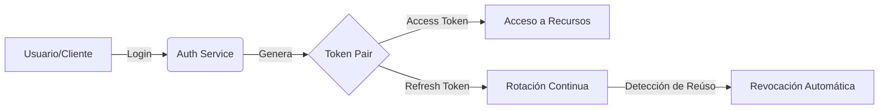

# userapp-api - Centro de Gestión de Identidad y Seguridad

Este proyecto es una API RESTful de alto rendimiento desarrollada con **Spring Boot 3.5.10** y **Java 17**. Su propósito fundamental es proporcionar un sistema robusto de gestión de usuarios con un enfoque crítico en la **seguridad avanzada**, implementando flujos de autenticación y autorización basados en JWT con mecanismos de protección de última generación.

## 🚀 Valor de la Solución: Seguridad Bidireccional
El mayor valor de `userapp-api` no es solo permitir el acceso, sino garantizar la integridad de las sesiones mediante:
- **JWT Stateless:** Autenticación sin estado para máxima escalabilidad.
- **Refresh Token & Token Rotation:** Implementa "Token Families", donde el uso de un Refresh Token antiguo invalida automáticamente toda la familia, previniendo ataques de robo de tokens.
- **Seguridad Bidireccional:** Control estricto tanto en la emisión como en la revocación de privilegios en tiempo real.

### Flujo Visual de Valor:

## 🛠 Stack Tecnológico
- **Framework:** Spring Boot 3.5.10
- **Lenguaje:** Java 17 (Uso de Records, Sealed Classes)
- **Seguridad:** Spring Security + JJWT (Java JWT)
- **Persistencia:** MySQL (Producción) / H2 (Tests) + Spring Data JPA
- **Mapeo:** MapStruct (Conversión eficiente DTO-Entidad)
- **Utilidades:** Lombok (Código limpio), Spring Mail (Notificaciones)
- **Calidad:** JUnit 5, Mockito, Spotless (Google Java Format)

## 🏛 Arquitectura y Patrones
- **Arquitectura en Capas:** `Controller` -> `Service` -> `Repository`.
- **Event-Driven:** Uso de `ApplicationEventPublisher` para notificaciones asíncronas (ej. envío de correos tras registro) sin bloquear el flujo principal.
- **Auditoría:** Registro automático de creación y modificación de entidades mediante `Auditable` y `AuditConfig`.
- **Estrategia de Auth Dual:** Proveedores diferenciados para Administradores (In-Memory) y Usuarios (Base de datos).

## 🎯 Casos de Uso Principales
1. **Registro Seguro de Usuarios:** Validación estricta de datos y hashing de contraseñas.
2. **Autenticación con Rotación:** Emisión de pares de tokens (Access/Refresh) con vida útil controlada.
3. **Control de Acceso Basado en Roles (RBAC):** Restricción de endpoints según permisos específicos.
4. **Notificaciones Automatizadas:** Envío de correos de bienvenida de forma asíncrona.
5. **Gestión de Sesiones Activas:** Monitoreo y revocación de tokens sospechosos.

## 🛠 Comandos Clave
- **Construir:** `./mvnw clean install`
- **Ejecutar:** `./mvnw spring-boot:run`
- **Tests:** `./mvnw test`
- **Formatear:** `./mvnw spotless:apply`

---
*Este documento sirve como contexto maestro para Gemini CLI dentro del workspace de userapp-api.*
