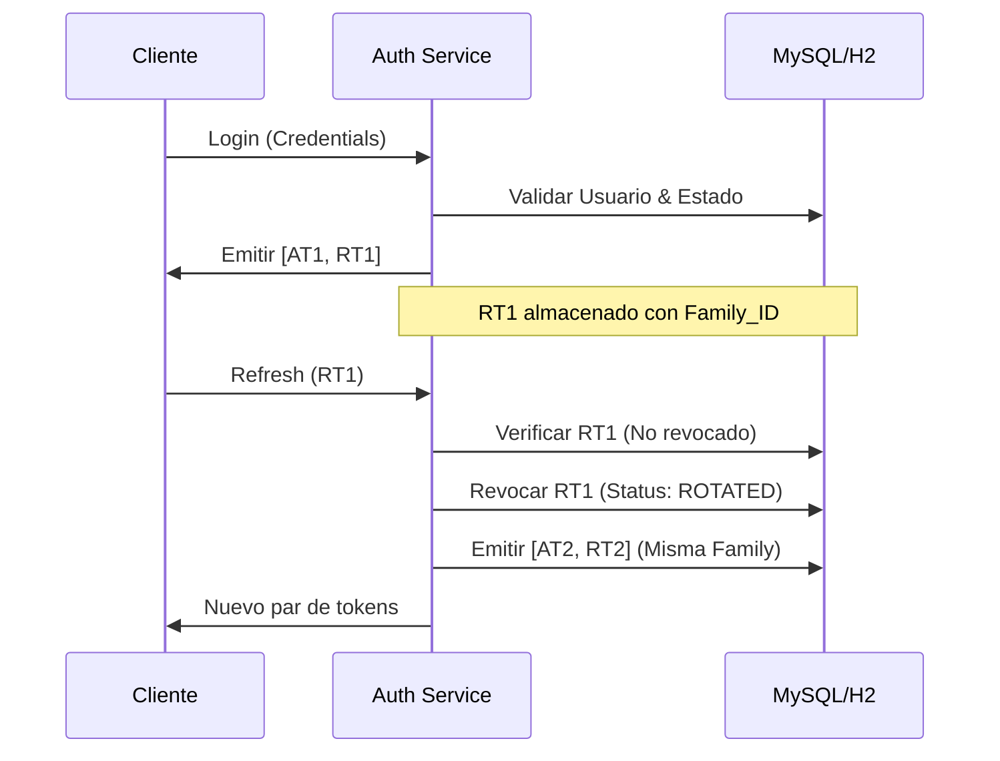
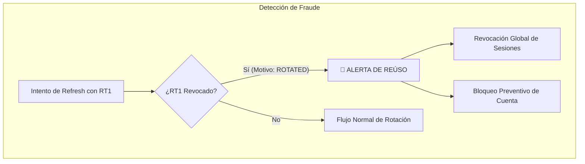

# UserApp API - Identity & Advanced Security Core


`userapp-api` es un núcleo de identidad y seguridad de grado empresarial diseñado para gestionar la autenticación y autorización con un enfoque de **Seguridad Bidireccional**. Implementa estándares modernos para mitigar riesgos como el secuestro de sesiones y el robo de credenciales mediante un flujo avanzado de JWT y rotación de tokens.

---

## 🛡️ Seguridad Avanzada (Bidireccional)

A diferencia de las implementaciones JWT tradicionales que son puramente *stateless* y difíciles de invalidar, este core implementa una capa de persistencia inteligente para el control de sesiones.

### Flujo de Autenticación y Rotación (Token Families)
Implementamos el concepto de **Token Rotation**. Cada vez que se solicita un nuevo `access_token` usando un `refresh_token`, este último se invalida y se emite un nuevo par. Esto forma una "familia de tokens" vinculada a una sesión específica.



### Detección de Reúso y Revocación Global
Si un atacante intercepta un `refresh_token` y lo utiliza después de que el cliente legítimo ya lo haya rotado, el sistema detecta el intento de reúso y **revoca automáticamente toda la familia de tokens** del usuario por sospecha de fraude.



---

## 🔐 Atributos de Seguridad de Cuenta

La entidad `User` integra un componente embebible `AccountSecurityState` que gestiona el ciclo de vida de seguridad del usuario:

- **Login Throttling:** Control de reintentos fallidos. Tras N intentos (configurables), la cuenta se bloquea automáticamente (`accountNonLocked = false`).
- **Account Lifecycle:** Soporte nativo para estados `enabled`, `accountNonExpired`, y `credentialsNonExpired`.
- **Revocación Selectiva:** A través del `TokenController`, los usuarios pueden:
    - Ver sesiones activas (`ipAddress`, `deviceInfo`).
    - Revocar una sesión específica (Cerrar sesión en otro dispositivo).
    - Revocación Global (Logout en todos los dispositivos).

---

## 🏛️ Arquitectura & Clean Code

El proyecto sigue una arquitectura de capas con **Alta Cohesión** y **Bajo Acoplamiento**, aplicando principios **SOLID**:

- **Inyección por Constructor:** Uso estricto de `@RequiredArgsConstructor` sobre campos `final`, evitando el uso de `@Autowired` en campos para facilitar la testabilidad y la inmutabilidad.
- **Mapeo Eficiente:** Uso de **MapStruct** para desacoplar las entidades de base de datos de los DTOs de transporte, evitando la exposición de lógica interna.
- **AOP (Performance Monitoring):** Implementación de Aspectos (`PerformanceMonitorAspect`) para el logging de métricas de ejecución de forma no invasiva mediante la anotación `@LogExecutionTime`.
- **Event-Driven Architecture:** Registro de usuarios desacoplado del envío de correos mediante `ApplicationEventPublisher` y `TransactionalEventListener`, garantizando que el correo solo se envíe si la transacción de DB fue exitosa.

---

## 📂 Estructura del Proyecto

```text
src/main/java/userapp/.../userappapi/
├── annotation/      # Validaciones personalizadas y AOP
├── configuration/   # Seguridad, Async y Auditoría JPA
├── controller/      # REST Endpoints (Versionados)
├── dto/            # Data Transfer Objects (Records de Java 17)
├── entity/         # Modelo de persistencia y Auditoría
├── mapper/         # Interfaces de MapStruct
├── notification/   # Lógica de Eventos y Listeners asíncronos
├── repository/     # Capa de acceso a datos (Spring Data JPA)
├── security/       # Core de seguridad (JWT, UserDetails, AuthServices)
└── service/        # Lógica de negocio e interfaces
```

Esta estructura facilita el mantenimiento y la escalabilidad, permitiendo que cada módulo evolucione de forma independiente (ej. cambiar el motor de JWT sin afectar la lógica de negocio).

---

## 🛠️ Stack Tecnológico

- **Java 17:** Aprovechando `Records` para DTOs e inmutabilidad.
- **Spring Boot 3.5.10:** Última versión estable con optimizaciones de rendimiento.
- **Spring Security 6:** Configuración funcional de filtros y RBAC.
- **JJWT (io.jsonwebtoken):** Implementación robusta para la firma y parseo de tokens.
- **MapStruct 1.6.3:** Generación de mapeadores en tiempo de compilación.
- **MySQL / H2:** Soporte dual para producción y testing.
- **Lombok:** Reducción de código boilerplate mediante anotaciones.

---

## 🚀 Guía de Inicio Rápido

1. **Clonar el repositorio:**
   ```bash
   [git clone https://github.com/tu-usuario/userapp-api.git](https://github.com/brian-duran/Nexus-Auth-Family.git)
   ```
2. **Configurar variables de entorno:**
   Crea un archivo `.env` o configura tu IDE con: `DB_URL`, `DB_USERNAME`, `DB_PASSWORD`, `JWT_SECRET`.
3. **Ejecutar Tests:**
   ```bash
   ./mvnw test
   ```
4. **Iniciar Aplicación:**
   ```bash
   ./mvnw spring-boot:run
   ```

---
Desarrollado por **Brian Duran**.
